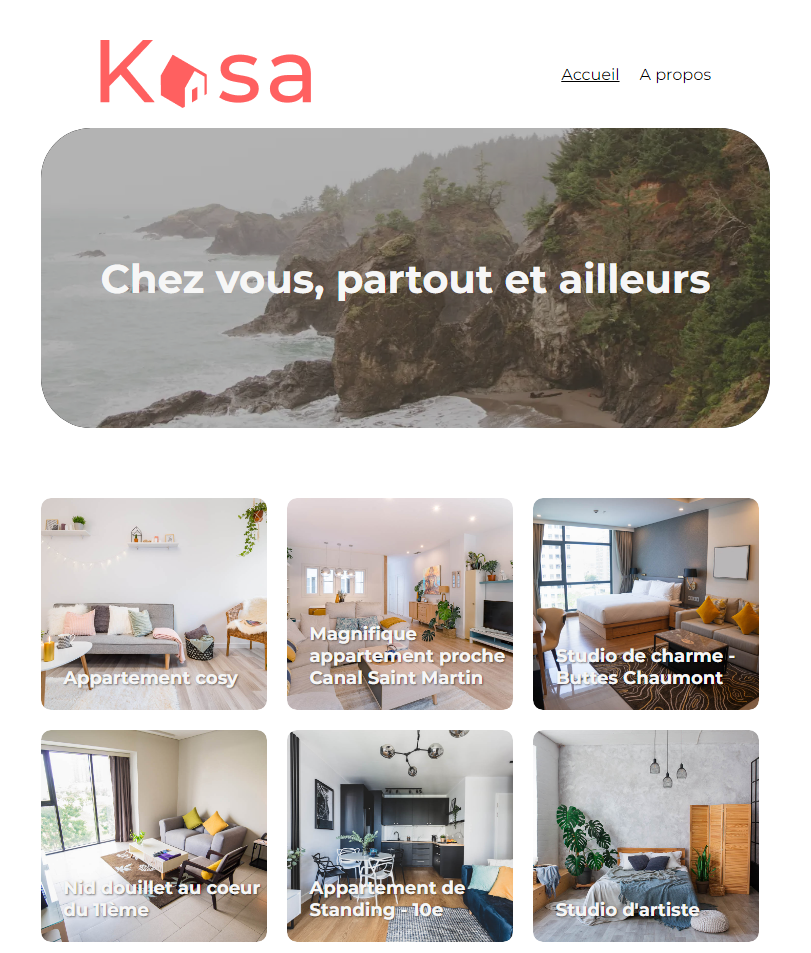

# Kaza / React

## What this project is for?

School project 5 for my training as full-stack web developper with OpenClassrooms.

## Description

The purpose of this project is to learn React by building a modern apartment rental website from a mockup only. It involves learning to use components, useState, useEffect, routers, and other related concepts

## Technologies

- HTLM
- SCSS
- Javascript
- Create React App

## Hosted result of project

https://kaza.pages.dev/

## How to Contribute

Contact me on my portfolio : https://www.dosylia.com/
